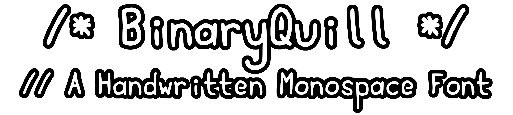
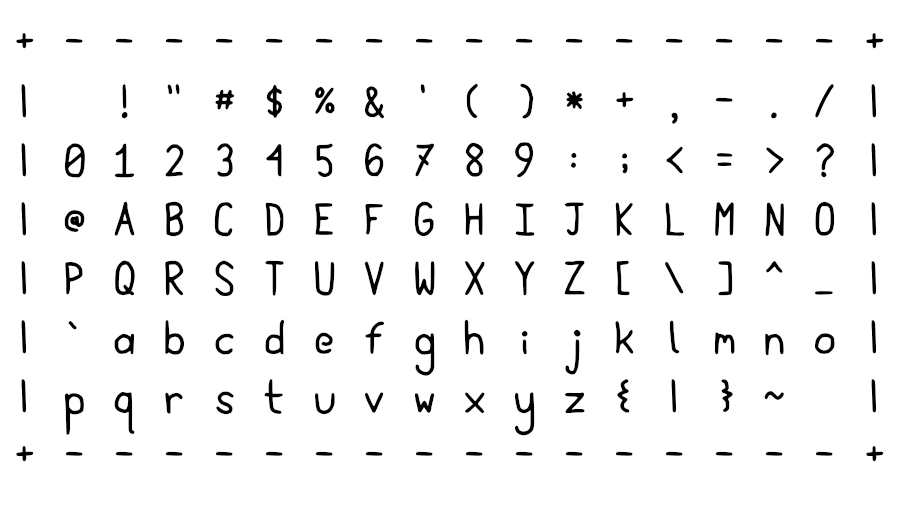

BinaryQuill is a handwritten monospace font largely intended for the purpose of rendering code with a handwritten aesthetic.

BinaryQuill was created and is maintained by using GIMP to draw characters and FontForge to import and autotrace, and when necessary make manual corrections to the raster characters.

The project is layed out as follows: BinaryQuill.ttf is the font in ttf format; raster.xcf is the GIMP source file, it contains 4 layers: "Background" which is a pure white layer, "G" which holds the drawing guides, "C" which holds the characters themselves, and "X" which contains a red scribble over any characters that have been replaced with newer varients; And source.sfd is the FontForge source file. All files in /showcase are images to showcase various parts of this font, many of which are utilized by this README file.

# Changelog:

v001.001 | Updated the following Characters: "Z", "z", "@", "&", "$", "a", ":", ";", and "/". "Z" and "z" to remove the stroke, "@", "&", and "$" with various minor aesthetic changes, "a" to change the right stroke to be vertical rather than at an angle to better align with the rest of the font, ":" and ";" to lower their position so as to align with the lowercase letters rather than the middle of the full vertical span, and "/" to fill the whole vertical space rather than just the center.

v001.000 | Added the initial ASCII Characters.

v000.000 | Font initialized.